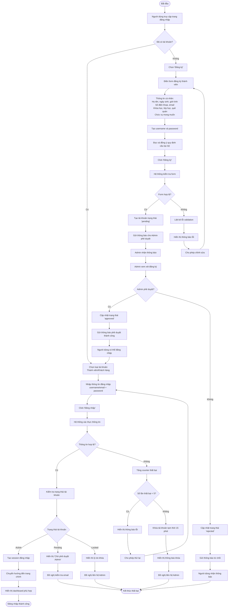
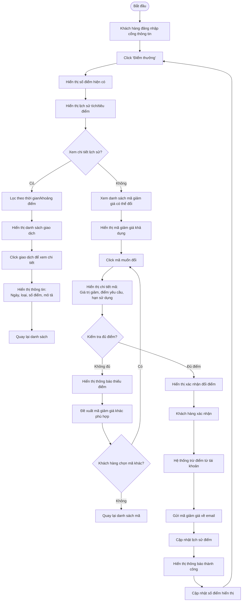

# Activity Diagrams - Sơ đồ Hoạt động

## AD-001: Hoạt động đăng nhập hệ thống



## AD-002: Hoạt động đăng ký dịch vụ khách hàng

```mermaid
flowchart TD
    A([Bắt đầu]) --> B[Khách hàng đã đăng nhập]

    B --> C[Click 'Đăng ký sửa chữa']
    C --> D[Hệ thống tự động điền thông tin cá nhân]

    D --> E[Mô tả chi tiết thiết bị và vấn đề]
    E --> F[Chọn loại dịch vụ sửa chữa từ danh sách]
    F --> G[Chọn thời gian hẹn mong muốn]

    G --> H[Hệ thống kiểm tra lịch trống]
    H --> I{Lịch có slot trống?}

    I -->|Không| J[Đề xuất các thời gian thay thế]
    J --> K[Khách hàng chọn thời gian mới]
    K --> G

    I -->|Có| L[Upload hình ảnh thiết bị (tùy chọn)]
    L --> M[Hệ thống tính toán chi phí ước tính]
    M --> N[Tính điểm thưởng sẽ nhận]
    N --> O[Hiển thị tóm tắt đăng ký]

    E --> P{Sử dụng mã giảm giá?}
    P -->|Có| Q[Nhập mã giảm giá]
    Q --> R[Hệ thống kiểm tra mã]
    R --> S{Mã hợp lệ?}

    S -->|Có| T[Áp dụng giảm giá vào chi phí]
    T --> U[Cập nhật điểm thưởng]
    U --> O

    S -->|Không| V[Hiển thị lỗi validation]
    V --> W[Đề xuất mã giảm giá khả dụng khác]
    W --> X{Khách hàng muốn thử lại?}
    X -->|Có| Q
    X -->|Không| Y[Tiếp tục không dùng mã]
    Y --> O

    E --> Z{Đăng ký khẩn cấp?}
    Z -->|Có| AA[Chọn tùy chọn 'khẩn cấp']
    AA --> BB[Hiển thị phí dịch vụ cao hơn]
    BB --> CC[Xác nhận đồng ý]
    CC --> DD[Đánh dấu ưu tiên xử lý]
    DD --> G

    E --> EE{Thiết bị đã sửa trước đó?}
    EE -->|Có| FF[Chọn từ lịch sử thiết bị]
    FF --> GG[Hệ thống điền thông tin thiết bị cũ]
    GG --> HH[Cập nhật tình trạng hiện tại]
    HH --> II[Kiểm tra thời hạn bảo hành]
    II --> JJ{Còn bảo hành?}

    JJ -->|Có| KK[Chọn chế độ bảo hành]
    KK --> F

    JJ -->|Không| LL[Tiếp tục đăng ký dịch vụ thường]
    LL --> F

    O --> MM[Xác nhận và submit đăng ký]
    MM --> NN[Hệ thống kiểm tra giới hạn phiếu]
    NN --> OO{Số phiếu chờ ≤ 3?}

    OO -->|Không| PP[Hiển thị thông báo vượt giới hạn]
    PP --> QQ[Đề nghị hoàn thành phiếu cũ trước]
    QQ --> RR{Khách hàng muốn tiếp tục?}
    RR -->|Có| SS[Chọn phiếu cũ để hủy/thay đổi]
    RR -->|Không| TT([Hủy đăng ký])

    OO -->|Có| UU[Tạo phiếu với trạng thái 'online']
    UU --> VV[Tạo mã QR duy nhất]
    VV --> WW[Gửi SMS thông báo với mã QR]
    WW --> XX[Gửi email hướng dẫn (nếu có)]
    XX --> YY[Cho phép theo dõi trạng thái realtime]
    YY --> ZZ([Đăng ký thành công])
```

## AD-003: Hoạt động phê duyệt đăng ký trực tuyến

```mermaid
flowchart TD
    A([Bắt đầu]) --> B[Khách hàng submit đăng ký trực tuyến]

    B --> C[Hệ thống tạo phiếu 'online']
    C --> D[Tạo mã QR và gửi thông báo]
    D --> E[Phiếu chờ phê duyệt tại quầy]

    E --> F[Khách hàng đến cửa hàng với mã QR]
    F --> G[Tester quét mã QR]
    G --> H[Hiển thị thông tin đăng ký]

    H --> I[Tester kiểm tra thiết bị thực tế]
    I --> J{Thông tin khớp với đăng ký?}

    J -->|Không| K[Yêu cầu khách hàng cập nhật thông tin]
    K --> L[Khách hàng cung cấp thông tin chính xác]
    L --> I

    J -->|Có| M[Tester đánh giá sơ bộ thiết bị]
    M --> N{Có thể sửa chữa được?}

    N -->|Không| O[Thông báo không thể sửa chữa]
    O --> P[Giải thích lý do cho khách hàng]
    P --> Q[Đề xuất phương án thay thế]
    Q --> R[Khách hàng quyết định]
    R --> S{Hủy đăng ký?}
    S -->|Có| T[Hủy phiếu và hoàn tiền nếu đã thanh toán]
    S -->|Không| U[Cập nhật đăng ký với phương án mới]
    U --> I

    N -->|Có| V[Tester/Admin phê duyệt đăng ký]
    V --> W{Được phê duyệt?}

    W -->|Không| X[Ghi lý do từ chối]
    X --> Y[Thông báo khách hàng]
    Y --> Z[Khách hàng xem xét]
    Z --> AA{Muốn cập nhật đăng ký?}
    AA -->|Có| BB[Cập nhật thông tin]
    BB --> I
    AA -->|Không| T

    W -->|Có| CC[Chuyển phiếu thành 'WAITING']
    CC --> DD[Bắt đầu quy trình 5 giai đoạn (P1)]
    DD --> EE[Tester tiếp nhận và thu thập thông tin chi tiết]
    EE --> FF([Chuyển sang WF-001])
```

## AD-004: Hoạt động quản lý điểm thưởng



## AD-005: Hoạt động thực hiện quy trình 5 giai đoạn

```mermaid
flowchart TD
    A([Bắt đầu]) --> B[Phiếu được tạo và phân công]

    B --> C[P1: Thu thập thông tin]
    C --> D[Tester thu thập thông tin khách hàng]
    D --> E[Ghi nhận thông tin thiết bị]
    E --> F[Kiểm tra bảo hành và yêu cầu]
    F --> G[Chọn dịch vụ bổ sung]
    G --> H[Tạo phiếu chi tiết]
    H --> I[Cập nhật trạng thái WAITING → RUNNING]

    I --> J[P2: Kiểm tra sơ bộ]
    J --> K[Tester thực hiện test cơ bản]
    K --> L[Tạo checklist ban đầu]
    L --> M[Ghi nhận vấn đề phát hiện]
    M --> N[Chụp ảnh thiết bị nếu cần]
    N --> O[Cập nhật phiếu]

    O --> P[Admin phân công Kỹ thuật viên]
    P --> Q[P3: Thực hiện sửa chữa]
    Q --> R[Kỹ thuật viên nhận phiếu]
    R --> S[Chuẩn bị dụng cụ và linh kiện]
    S --> T[Thực hiện công việc sửa chữa]
    T --> U[Cập nhật checklist kỹ thuật]
    U --> V[Ghi chú chi tiết quá trình]
    V --> W[Báo cáo hoàn thành cho Admin]
    W --> X[Cập nhật trạng thái RUNNING → RETESTING]

    X --> Y[Admin phân công Tester]
    Y --> Z[P4: Kiểm tra chất lượng]
    Z --> AA[Tester thực hiện test toàn diện]
    AA --> BB[Xác minh yêu cầu đã hoàn thành]
    BB --> CC[Tạo checklist kiểm tra cuối]
    CC --> DD[Ghi nhận kết quả test]
    DD --> EE[Chụp ảnh thiết bị sau sửa]
    EE --> FF[Báo cáo kết quả cho Admin]

    FF --> GG{Test đạt chất lượng?}
    GG -->|Không đạt| HH[Tester từ chối phiếu]
    HH --> II[Ghi lý do chi tiết]
    II --> JJ[Admin xem xét]
    JJ --> KK{Admin quyết định}
    KK -->|Sửa lại| LL[Phân công lại Kỹ thuật viên]
    KK -->|Hủy phiếu| MM[Hủy phiếu và thông báo]
    LL --> Q

    GG -->|Đạt| NN[Cập nhật trạng thái RETESTING → RETURNING]
    NN --> OO[P5: Xác nhận hoàn thành]
    OO --> PP[Admin xem xét tất cả báo cáo]
    PP --> QQ[Tính toán chi phí cuối cùng]
    QQ --> RR[Áp dụng giảm giá nếu có]
    RR --> SS[Tính điểm tích lũy tự động]
    SS --> TT[Tạo hóa đơn chi tiết]
    TT --> UU[Thu thanh toán từ khách hàng]
    UU --> VV[Ký điện tử xác nhận]
    VV --> WW[Bàn giao thiết bị và hóa đơn]
    WW --> XX[Cập nhật trạng thái RETURNING → COMPLETE]
    XX --> YY[Lưu lịch sử điểm cho khách hàng]
    YY --> ZZ([Hoàn thành quy trình])
```



## AD-006: Hoạt động tích điểm tự động

```mermaid
flowchart TD
    A([Bắt đầu]) --> B[Phiếu chuyển sang COMPLETE hoặc RETURNED]

    B --> C[Hệ thống kiểm tra điều kiện tích điểm]
    C --> D{Thanh toán hoàn tất?}
    D -->|Chưa| E[Không tích điểm]
    D -->|Rồi| F{Có chi phí > 0?}

    F -->|Không| E
    F -->|Có| G[Lấy quy tắc điểm thưởng hiện tại]

    G --> H[Áp dụng quy tắc per_order]
    H --> I[Cộng điểm từ tất cả quy tắc per_order]

    I --> J[Lọc quy tắc amount_threshold]
    J --> K[Sắp xếp theo ngưỡng giảm dần]
    K --> L[Lấy quy tắc cao nhất thỏa mãn]
    L --> M[Cộng điểm từ quy tắc amount_threshold]

    M --> N[Tổng điểm tích lũy = per_order + threshold]
    N --> O{Tổng điểm > 0?}

    O -->|Có| P[Tạo bản ghi lịch sử điểm]
    P --> Q[Lưu vào cơ sở dữ liệu]
    Q --> R[Cập nhật điểm khách hàng]
    R --> S[Gửi thông báo tích điểm]
    S --> T[Hiển thị popup thông báo]
    T --> U[Lưu lịch sử giao dịch]
    U --> V([Tích điểm thành công])

    O -->|Không| W[Không có điểm để tích]
    W --> E
```</content>
</xai:function_call">Create comprehensive activity diagrams for all key processes