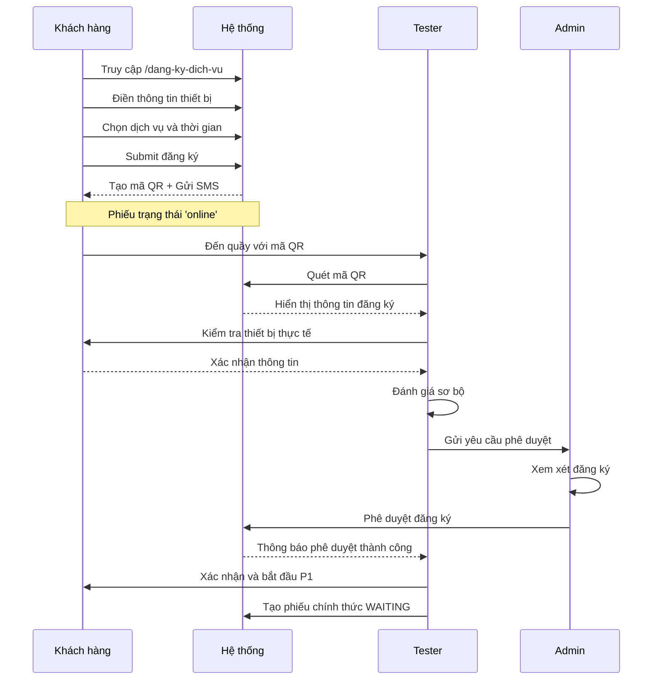
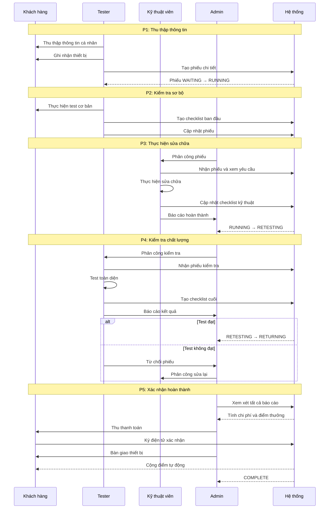
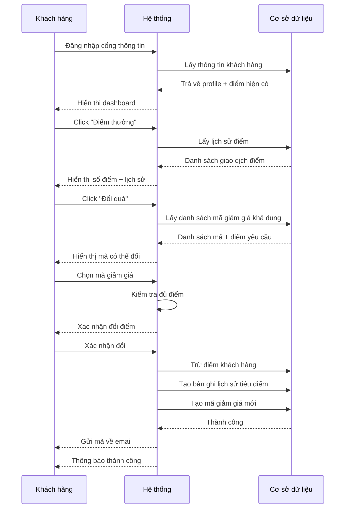
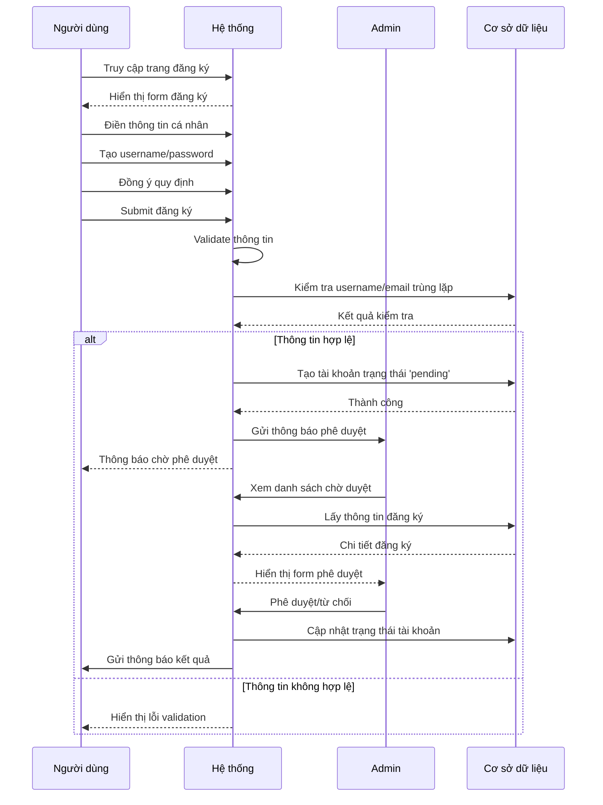
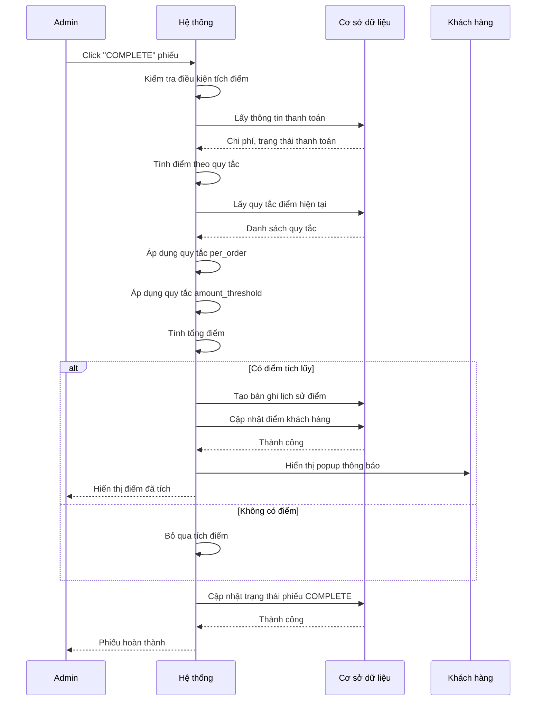
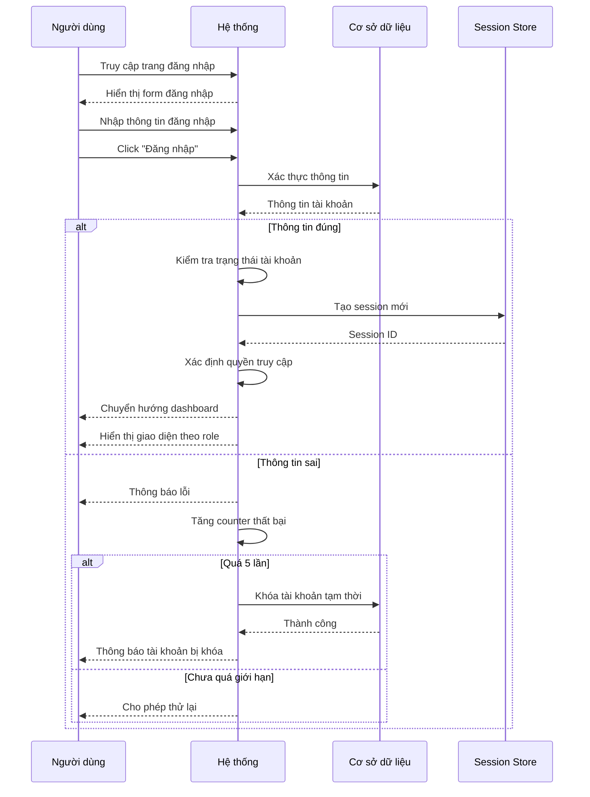

# Sequence Diagrams - Sơ đồ Tuần tự

## SD-001: Đăng ký và phê duyệt trực tuyến



## SD-002: Quy trình 5 giai đoạn hoàn chỉnh



## SD-003: Quản lý điểm thưởng khách hàng



## SD-004: Đăng ký thành viên mới



## SD-005: Tích điểm tự động khi hoàn thành



## SD-006: Đăng nhập và phân quyền



## SD-007: Phê duyệt đăng ký trực tuyến tại quầy

```mermaid
sequenceDiagram
    participant KH as Khách hàng
    participant TS as Tester
    participant HT as Hệ thống
    participant DB as Cơ sở dữ liệu

    KH->>TS: Đến quầy với mã QR
    TS->>HT: Quét mã QR
    HT->>DB: Tìm phiếu theo mã QR
    DB-->>HT: Thông tin đăng ký

    HT-->>TS: Hiển thị thông tin đăng ký

    TS->>KH: Kiểm tra thiết bị thực tế
    KH-->>TS: Xác nhận thông tin khớp/không khớp

    alt Thông tin không khớp
        TS->>HT: Yêu cầu cập nhật
        HT-->>KH: Form cập nhật thông tin
        KH->>HT: Cập nhật thông tin mới
        HT->>DB: Lưu thay đổi
    end

    TS->>TS: Đánh giá sơ bộ
    TS->>HT: Phê duyệt/từ chối

    alt Phê duyệt
        HT->>DB: Chuyển trạng thái 'online' → 'WAITING'
        HT-->>TS: Thông báo thành công
        TS->>KH: Xác nhận và bắt đầu quy trình
    else Từ chối
        HT->>DB: Ghi lý do từ chối
        HT-->>KH: Thông báo từ chối + lý do
    end
```</content>
</xai:function_call">Create sequence diagrams showing detailed interactions between actors and systems