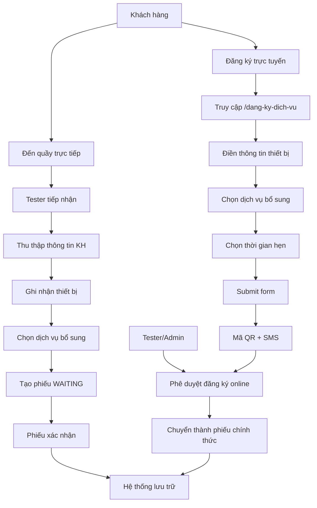
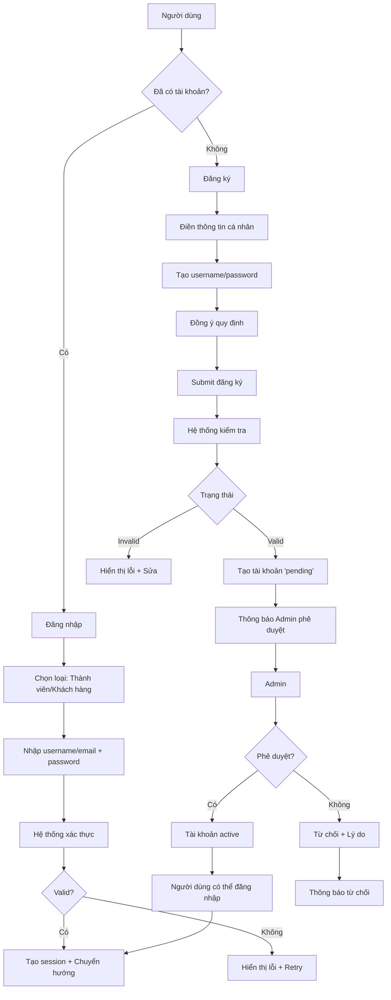
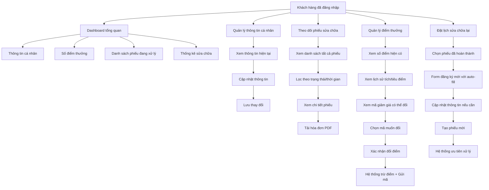
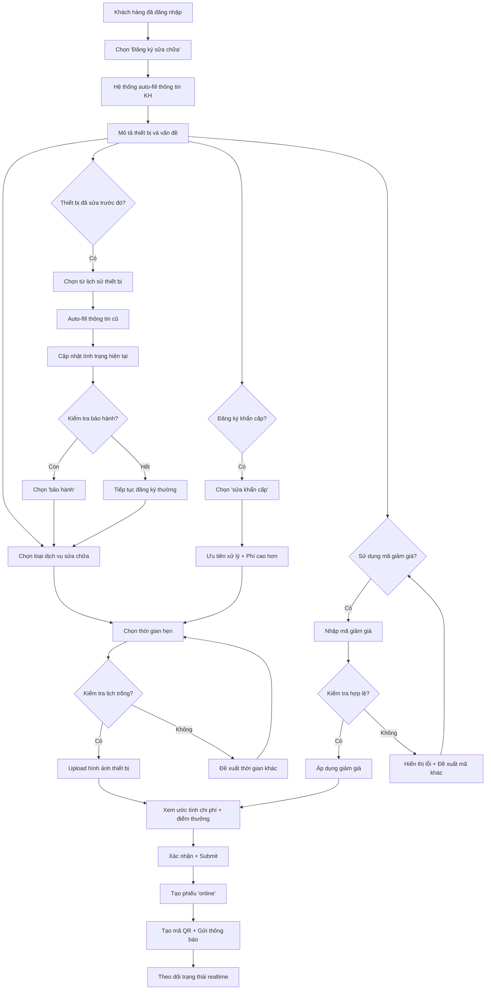

# Use Case Diagrams - Sơ đồ Use Case

## UC-001: Đăng ký yêu cầu sửa chữa



## UC-002: Đăng nhập và Đăng ký thành viên



## UC-003: Cổng thông tin khách hàng



## UC-004: Khách hàng đăng ký dịch vụ sửa chữa



## Tổng quan hệ thống Use Case

```mermaid
graph TD
    subgraph "Khách hàng"
        KH1[Đăng ký trực tuyến]
        KH2[Đăng nhập cổng thông tin]
        KH3[Theo dõi phiếu sửa chữa]
        KH4[Quản lý điểm thưởng]
        KH5[Đặt lịch sửa chữa lại]
    end

    subgraph "Thành viên"
        TV1[Đăng nhập hệ thống]
        TV2[Đăng ký thành viên mới]
        TV3[Quản lý phiếu sửa chữa]
        TV4[Thực hiện quy trình 5 giai đoạn]
        TV5[Cập nhật trạng thái]
    end

    subgraph "Admin"
        AD1[Phê duyệt đăng ký thành viên]
        AD2[Phân công nhân sự]
        AD3[Xác nhận hoàn thành]
        AD4[Quản lý hệ thống]
        AD5[Giám sát dashboard]
    end

    subgraph "Tester"
        TS1[Tiếp nhận khách hàng]
        TS2[Tạo phiếu yêu cầu]
        TS3[Thực hiện kiểm tra]
        TS4[Kiểm tra chất lượng]
        TS5[Phê duyệt đăng ký online]
    end

    subgraph "Kỹ thuật viên"
        KT1[Nhận phiếu phân công]
        KT2[Thực hiện sửa chữa]
        KT3[Cập nhật checklist]
        KT4[Báo cáo tiến độ]
    end

    KH1 --> TS5
    TS5 --> AD2

    KH2 --> KH3
    KH2 --> KH4
    KH2 --> KH5

    TV2 --> AD1
    TV1 --> TV3
    TV1 --> TV4
    TV1 --> TV5

    TS1 --> TS2
    TS3 --> TS4

    KT1 --> KT2
    KT2 --> KT3
    KT3 --> KT4
    KT4 --> AD3
```</content>
</xai:function_call">Create comprehensive use case diagrams for all the use cases