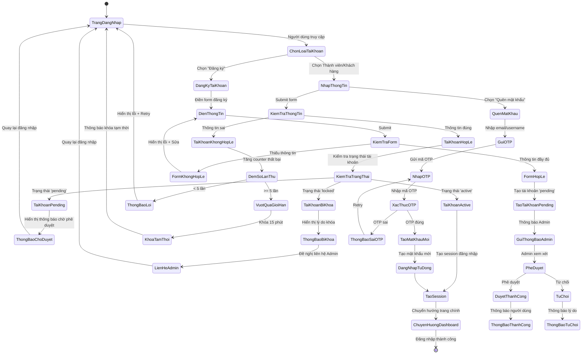
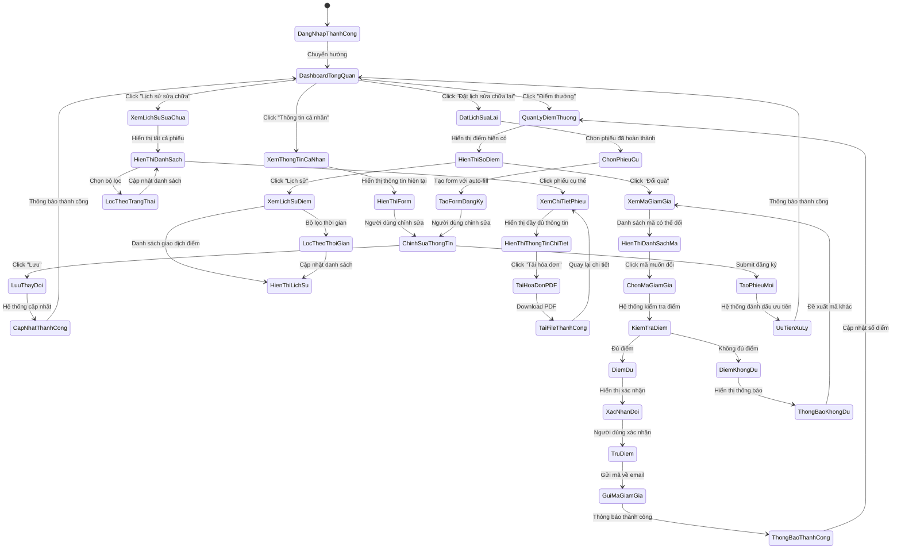
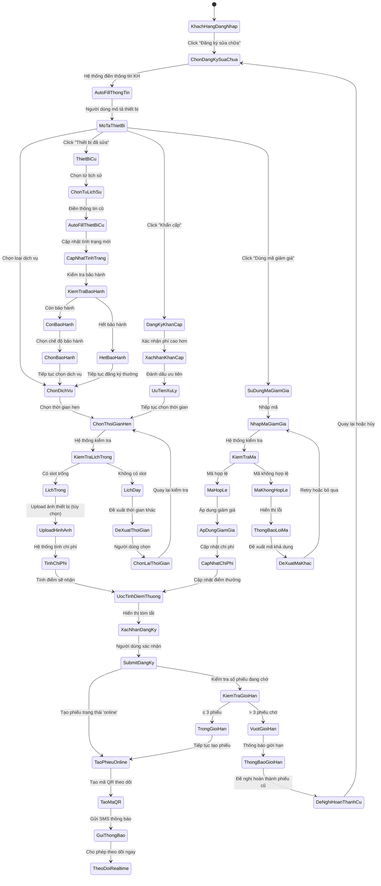

# Workflow Diagrams - Sơ đồ Quy trình

## WF-003: Quy trình đăng nhập và xác thực



## WF-004: Quy trình cổng thông tin khách hàng



## WF-005: Quy trình đăng ký dịch vụ khách hàng



## WF-006: Quy trình phê duyệt đăng ký trực tuyến

```mermaid
stateDiagram-v2
    [*] --> KhachHangSubmitDangKy

    KhachHangSubmitDangKy --> TaoPhieuOnline: Tạo phiếu 'online'
    TaoPhieuOnline --> GuiMaQR: Gửi mã QR
    GuiMaQR --> ChoPheDuyet: Chờ phê duyệt

    ChoPheDuyet --> KhachHangDenQuay: Khách hàng đến cửa hàng
    KhachHangDenQuay --> TesterQuetQR: Tester quét mã QR

    TesterQuetQR --> HienThiThongTin: Hiển thị thông tin đăng ký
    HienThiThongTin --> KiemTraThietBi: Kiểm tra thiết bị thực tế
    KiemTraThietBi --> ThongTinKhop: Thông tin khớp
    KiemTraThietBi --> ThongTinKhongKhop: Thông tin không khớp

    ThongTinKhongKhop --> YeuCauCapNhat: Yêu cầu cập nhật
    YeuCauCapNhat --> KhachHangCapNhat: Khách hàng cập nhật
    KhachHangCapNhat --> KiemTraThietBi: Kiểm tra lại

    ThongTinKhop --> DanhGiaSoBo: Đánh giá sơ bộ
    DanhGiaSoBo --> CoTheSua: Có thể sửa chữa
    DanhGiaSoBo --> KhongTheSua: Không thể sửa chữa

    KhongTheSua --> ThongBaoKhongSua: Thông báo khách hàng
    ThongBaoKhongSua --> HuyDangKy: Hủy đăng ký
    HuyDangKy --> [*]: Kết thúc

    CoTheSua --> PheDuyet: Tester/Admin phê duyệt
    PheDuyet --> ChuyenThanhPhieuChinhThuc: Chuyển thành phiếu WAITING
    ChuyenThanhPhieuChinhThuc --> BatDauQuyTrinhP1: Bắt đầu quy trình 5 giai đoạn
    BatDauQuyTrinhP1 --> [*]: Tiếp tục WF-001

    PheDuyet --> TuChoiPheDuyet: Nếu có vấn đề
    TuChoiPheDuyet --> ThongBaoLyDo: Thông báo lý do từ chối
    ThongBaoLyDo --> ChoKhachHangQuyetDinh: Khách hàng quyết định
    ChoKhachHangQuyetDinh --> CapNhatDangKy: Cập nhật và thử lại
    ChoKhachHangQuyetDinh --> HuyDangKy: Hủy đăng ký

    CapNhatDangKy --> ChoPheDuyet: Quay lại chờ phê duyệt
```</content>
</xai:function_call">Create detailed workflow diagrams for all the processes